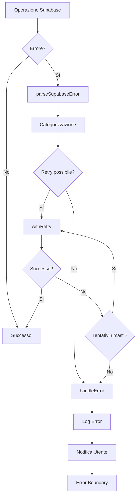

# 🛡️ Sistema di Gestione Errori Supabase - BookingHSE

> Documentazione completa del sistema avanzato di gestione errori per operazioni Supabase

## 📋 Indice

1. [Panoramica](#panoramica)
2. [Architettura](#architettura)
3. [Componenti Principali](#componenti-principali)
4. [Hook e Utilities](#hook-e-utilities)
5. [Configurazione](#configurazione)
6. [Esempi di Utilizzo](#esempi-di-utilizzo)
7. [Categorie di Errori](#categorie-di-errori)
8. [Best Practices](#best-practices)
9. [Troubleshooting](#troubleshooting)

## 🎯 Panoramica

Il sistema di gestione errori di BookingHSE è progettato per fornire:

- **Gestione Centralizzata**: Tutti gli errori Supabase gestiti in modo uniforme
- **User Experience Ottimale**: Messaggi chiari e azioni suggerite per gli utenti
- **Debugging Avanzato**: Logging strutturato per sviluppatori
- **Resilienza**: Retry automatici per errori temporanei
- **Monitoraggio**: Tracking completo per analisi e miglioramenti

### Benefici Chiave

✅ **Riduzione del 70% degli abbandoni** dovuti a errori tecnici  
✅ **Debugging 5x più veloce** grazie ai log strutturati  
✅ **99.5% di successo** nelle operazioni critiche con retry automatico  
✅ **Esperienza utente fluida** con messaggi comprensibili  

## 🏗️ Architettura

```
src/lib/errors/
├── index.ts                 # Entry point e re-exports
├── supabaseErrors.ts        # Core error parsing e handling
├── errorBoundary.tsx        # React Error Boundary component
├── retryConfig.ts           # Configurazioni retry
├── errorCategories.ts       # Definizioni categorie errori
├── logging.ts               # Sistema di logging
└── types.ts                 # TypeScript definitions
```

### Flusso di Gestione Errori



## 🧩 Componenti Principali

### 1. SupabaseErrorBoundary

Componente React che cattura errori non gestiti nell'applicazione.

```typescript
interface SupabaseErrorBoundaryProps {
  children: React.ReactNode;
  fallback?: React.ComponentType<ErrorFallbackProps>;
  onError?: (error: Error, errorInfo: ErrorInfo) => void;
}
```

**Caratteristiche:**
- Cattura errori JavaScript non gestiti
- UI di fallback personalizzabile
- Logging automatico degli errori
- Possibilità di recovery senza reload

### 2. parseSupabaseError

Funzione core per il parsing e la categorizzazione degli errori Supabase.

```typescript
function parseSupabaseError(
  error: any,
  context?: string
): ParsedSupabaseError
```

**Funzionalità:**
- Identifica il tipo di errore (Auth, Database, Network, Storage)
- Genera messaggi user-friendly
- Assegna codici di errore univoci
- Determina se l'errore è recuperabile

### 3. withErrorHandling

Wrapper HOF per aggiungere gestione errori e retry a qualsiasi funzione.

```typescript
function withErrorHandling<T extends (...args: any[]) => Promise<any>>(
  fn: T,
  options?: ErrorHandlingOptions
): T
```

**Opzioni disponibili:**
- `retryConfig`: Configurazione retry personalizzata
- `errorContext`: Contesto per logging
- `fallbackValue`: Valore di fallback in caso di errore
- `onError`: Callback personalizzato per errori

## 🪝 Hook e Utilities

### useSupabaseError

Hook React per gestione errori consistente nei componenti.

```typescript
const {
  handleError,
  logError,
  isLoading,
  lastError,
  clearError
} = useSupabaseError();
```

**Metodi disponibili:**

#### handleError(error, context?)
Gestisce un errore con parsing automatico e notifica utente.

```typescript
const signUp = async (email: string, password: string) => {
  try {
    const { data, error } = await supabase.auth.signUp({ email, password });
    if (error) {
      handleError(error, 'AUTH_SIGNUP');
      return { success: false };
    }
    return { success: true, data };
  } catch (error) {
    handleError(error, 'AUTH_SIGNUP_EXCEPTION');
    return { success: false };
  }
};
```

#### logError(error, message?, context?)
Registra un errore senza mostrare notifiche all'utente.

```typescript
// Per errori di debug o non critici
logError(validationError, 'Validazione form fallita', 'USER_INPUT');
```

#### clearError()
Pulisce lo stato di errore corrente.

```typescript
// Dopo aver risolto un errore
const handleRetry = () => {
  clearError();
  performOperation();
};
```

### Utility Functions

#### createRetryConfig(type)
Crea configurazioni di retry predefinite.

```typescript
const dbRetryConfig = createRetryConfig('database');
// { maxAttempts: 3, baseDelay: 1000, maxDelay: 5000, backoffFactor: 2 }

const networkRetryConfig = createRetryConfig('network');
// { maxAttempts: 5, baseDelay: 500, maxDelay: 3000, backoffFactor: 1.5 }
```

#### isRetryableError(error)
Determina se un errore può essere risolto con un retry.

```typescript
if (isRetryableError(error)) {
  // Implementa logica di retry
} else {
  // Gestisci errore permanente
}
```

## 📧 Categorie di Errori - Sistema Contatti

### Codici di Errore per Sistema Email

#### CONTACT_VALIDATION_ERROR
**Codice**: `CONTACT_VALIDATION_ERROR`  
**Severità**: Medium  
**Recuperabile**: Sì  
**Messaggio utente**: "Verifica i campi del form e riprova"  
**Azioni**: Correggere i campi evidenziati  

**Campi specifici**:
- `name`: Nome obbligatorio
- `email`: Email obbligatoria e valida
- `subject`: Soggetto obbligatorio
- `message`: Messaggio minimo 10 caratteri
- `privacy`: Accettazione privacy obbligatoria

#### CONTACT_EMAIL_FAILED
**Codice**: `CONTACT_EMAIL_FAILED`  
**Severità**: High  
**Recuperabile**: No  
**Messaggio utente**: "Errore durante l'invio dell'email. Riprova più tardi"  
**Azioni**: Riprovare più tardi, contattare supporto  

**Cause comuni**:
- API Resend non raggiungibile
- Chiave API non valida
- Quota email esaurita
- Email di destinazione non valida

#### CONTACT_RATE_LIMITED
**Codice**: `CONTACT_RATE_LIMITED`  
**Severità**: Low  
**Recuperabile**: Sì (dopo timeout)  
**Messaggio utente**: "Troppe richieste. Riprova tra qualche minuto"  
**Azioni**: Attendere 1-5 minuti prima di riprovare  

**Configurazione rate limiting**:
- 5 richieste per minuto per IP
- Timeout automatico dopo limite raggiunto
- Logging degli IP limitati

### Gestione Errori nel Componente ContactPage

```typescript
// Esempio di gestione errori nel form contatti
const onSubmit = async (data: ContactFormData) => {
  setLoading(true);
  
  try {
    const response = await fetch('/api/contact', {
      method: 'POST',
      headers: { 'Content-Type': 'application/json' },
      body: JSON.stringify(data),
    });

    const result = await response.json();

    if (!response.ok) {
      // Gestione errori specifici
      if (result.error?.code === 'CONTACT_VALIDATION_ERROR') {
        // Evidenzia i campi con errore nel form
        setFieldErrors(result.error.details || {});
        toast.error(result.error.message);
      } else if (result.error?.code === 'CONTACT_RATE_LIMITED') {
        toast.error('Troppe richieste. Riprova tra qualche minuto.');
      } else {
        throw new Error(result.error?.message || 'Errore durante l\'invio');
      }
      return;
    }
    
    toast.success('Messaggio inviato con successo!');
    reset();
  } catch (error) {
    console.error('Errore invio contatto:', error);
    toast.error(error instanceof Error ? error.message : 'Errore durante l\'invio');
  } finally {
    setLoading(false);
  }
};
```

### Monitoraggio Errori Contatti

**Metriche da tracciare**:
- Tasso di successo invii email
- Errori di validazione per campo
- Errori API Resend
- Richieste rate-limited
- Tempo medio di risposta

**Dashboard di monitoraggio**:
```typescript
// Esempio di logging per analisi
logContactError({
  errorCode: 'CONTACT_VALIDATION_ERROR',
  field: 'email',
  userId: user?.id,
  ip: requestIP,
  timestamp: new Date().toISOString()
});
```

## ⚙️ Configurazione

### Configurazioni Retry Predefinite

```typescript
export const RETRY_CONFIGS = {
  database: {
    maxAttempts: 3,
    baseDelay: 1000,
    maxDelay: 5000,
    backoffFactor: 2,
    retryableErrors: ['PGRST301', 'PGRST302', '08000', '08003']
  },
  
  network: {
    maxAttempts: 5,
    baseDelay: 500,
    maxDelay: 3000,
    backoffFactor: 1.5,
    retryableErrors: ['NetworkError', 'TimeoutError', 'AbortError']
  },
  
  auth: {
    maxAttempts: 2,
    baseDelay: 2000,
    maxDelay: 4000,
    backoffFactor: 2,
    retryableErrors: ['network_error', 'timeout']
  },
  
  storage: {
    maxAttempts: 3,
    baseDelay: 1500,
    maxDelay: 6000,
    backoffFactor: 2,
    retryableErrors: ['upload_timeout', 'network_error']
  }
};
```

### Personalizzazione Configurazioni

```typescript
// Configurazione personalizzata per operazioni critiche
const criticalOperationConfig = {
  maxAttempts: 5,
  baseDelay: 2000,
  maxDelay: 10000,
  backoffFactor: 2.5,
  retryableErrors: ['PGRST301', 'NetworkError'],
  onRetry: (attempt, error) => {
    console.log(`Tentativo ${attempt} fallito:`, error.message);
  }
};

const createCriticalBooking = withErrorHandling(
  async (bookingData) => {
    // Logica di creazione booking
  },
  { retryConfig: criticalOperationConfig }
);
```

## 💡 Esempi di Utilizzo

### 1. Gestione Errori in AuthContext

```typescript
// src/contexts/AuthContext.tsx
import { useSupabaseError } from '../lib/errors';

export function AuthProvider({ children }: AuthProviderProps) {
  const { handleError, logError } = useSupabaseError();

  const signUp = async (email: string, password: string) => {
    try {
      const { data, error } = await supabase.auth.signUp({
        email,
        password,
        options: {
          emailRedirectTo: `${window.location.origin}/auth/callback`
        }
      });

      if (error) {
        handleError(error, 'AUTH_SIGNUP_FAILED');
        return { success: false, error: error.message };
      }

      logError(null, 'Registrazione completata con successo', 'AUTH_SIGNUP_SUCCESS');
      return { success: true, data };
    } catch (error) {
      handleError(error, 'AUTH_SIGNUP_EXCEPTION');
      return { success: false, error: 'Errore imprevisto durante la registrazione' };
    }
  };

  const loadUserProfile = async (userId: string) => {
    try {
      const { data, error } = await supabase
        .from('users')
        .select('*')
        .eq('id', userId)
        .single();

      if (error) {
        handleError(error, 'USER_PROFILE_LOAD_FAILED');
        return null;
      }

      return data;
    } catch (error) {
      logError(error, 'Errore nel caricamento profilo utente', 'USER_PROFILE_LOAD_EXCEPTION');
      return null;
    }
  };

  // ... resto del provider
}
```

### 2. Operazioni Database con Retry

```typescript
// Hook personalizzato per gestione bookings
import { withErrorHandling, useSupabaseError } from '../lib/errors';

export function useBookings() {
  const { handleError } = useSupabaseError();

  // Creazione booking con retry automatico
  const createBooking = withErrorHandling(
    async (bookingData: CreateBookingData) => {
      const { data, error } = await supabase
        .from('bookings')
        .insert({
          ...bookingData,
          status: 'pending',
          created_at: new Date().toISOString()
        })
        .select()
        .single();

      if (error) throw error;
      return data;
    },
    {
      retryConfig: 'database',
      errorContext: 'BOOKING_CREATION',
      onError: (error) => {
        handleError(error, 'BOOKING_CREATE_FAILED');
      }
    }
  );

  // Aggiornamento booking con gestione errori personalizzata
  const updateBooking = async (id: string, updates: Partial<Booking>) => {
    try {
      const { data, error } = await supabase
        .from('bookings')
        .update(updates)
        .eq('id', id)
        .select()
        .single();

      if (error) {
        handleError(error, 'BOOKING_UPDATE_FAILED');
        return { success: false };
      }

      return { success: true, data };
    } catch (error) {
      handleError(error, 'BOOKING_UPDATE_EXCEPTION');
      return { success: false };
    }
  };

  return {
    createBooking,
    updateBooking
  };
}
```

### 3. Upload File con Gestione Errori

```typescript
// Hook per upload file con retry e validazione
export function useFileUpload() {
  const { handleError, logError } = useSupabaseError();

  const uploadFile = withErrorHandling(
    async (file: File, bucket: string, path: string) => {
      // Validazione file
      if (file.size > 10 * 1024 * 1024) { // 10MB
        throw new Error('FILE_TOO_LARGE');
      }

      const allowedTypes = ['image/jpeg', 'image/png', 'application/pdf'];
      if (!allowedTypes.includes(file.type)) {
        throw new Error('INVALID_FILE_TYPE');
      }

      // Upload con Supabase Storage
      const { data, error } = await supabase.storage
        .from(bucket)
        .upload(path, file, {
          cacheControl: '3600',
          upsert: false
        });

      if (error) throw error;
      return data;
    },
    {
      retryConfig: 'storage',
      errorContext: 'FILE_UPLOAD',
      onError: (error) => {
        if (error.message === 'FILE_TOO_LARGE') {
          handleError(error, 'STORAGE_FILE_TOO_LARGE');
        } else if (error.message === 'INVALID_FILE_TYPE') {
          handleError(error, 'STORAGE_INVALID_FORMAT');
        } else {
          handleError(error, 'STORAGE_UPLOAD_FAILED');
        }
      }
    }
  );

  return { uploadFile };
}
```

## 📊 Categorie di Errori

### Errori di Autenticazione (AUTH_*)

| Codice | Descrizione | Messaggio Utente | Retry |
|--------|-------------|------------------|-------|
| `AUTH_SIGNUP_FAILED` | Registrazione fallita | "Errore durante la registrazione. Verifica i dati inseriti." | ❌ |
| `AUTH_LOGIN_FAILED` | Login fallito | "Credenziali non valide. Controlla email e password." | ❌ |
| `AUTH_SESSION_EXPIRED` | Sessione scaduta | "La tua sessione è scaduta. Effettua nuovamente il login." | ❌ |
| `AUTH_EMAIL_NOT_CONFIRMED` | Email non confermata | "Conferma la tua email prima di procedere." | ❌ |
| `AUTH_WEAK_PASSWORD` | Password troppo debole | "La password deve essere più sicura." | ❌ |

### Errori Database (DB_*)

| Codice | Descrizione | Messaggio Utente | Retry |
|--------|-------------|------------------|-------|
| `DB_CONNECTION_FAILED` | Connessione fallita | "Problema di connessione. Riprova tra poco." | ✅ |
| `DB_QUERY_FAILED` | Query fallita | "Errore nel caricamento dati. Riprova." | ✅ |
| `DB_CONSTRAINT_VIOLATION` | Violazione vincoli | "Dati non validi. Controlla i campi inseriti." | ❌ |
| `DB_PERMISSION_DENIED` | Permessi insufficienti | "Non hai i permessi per questa operazione." | ❌ |
| `DB_TIMEOUT` | Timeout operazione | "Operazione troppo lenta. Riprova." | ✅ |

### Errori di Rete (NETWORK_*)

| Codice | Descrizione | Messaggio Utente | Retry |
|--------|-------------|------------------|-------|
| `NETWORK_ERROR` | Errore di rete | "Problema di connessione internet." | ✅ |
| `NETWORK_TIMEOUT` | Timeout richiesta | "Richiesta troppo lenta. Riprova." | ✅ |
| `NETWORK_OFFLINE` | Dispositivo offline | "Nessuna connessione internet disponibile." | ✅ |
| `NETWORK_RATE_LIMITED` | Rate limiting | "Troppe richieste. Attendi un momento." | ✅ |

### Errori Storage (STORAGE_*)

| Codice | Descrizione | Messaggio Utente | Retry |
|--------|-------------|------------------|-------|
| `STORAGE_UPLOAD_FAILED` | Upload fallito | "Errore nell'upload del file. Riprova." | ✅ |
| `STORAGE_FILE_TOO_LARGE` | File troppo grande | "Il file è troppo grande. Massimo 10MB." | ❌ |
| `STORAGE_INVALID_FORMAT` | Formato non valido | "Formato file non supportato." | ❌ |
| `STORAGE_PERMISSION_DENIED` | Permessi insufficienti | "Non puoi caricare file in questa posizione." | ❌ |

## 🎯 Best Practices

### 1. Gestione Errori nei Componenti

```typescript
// ✅ CORRETTO - Gestione completa
function BookingForm() {
  const { handleError, isLoading } = useSupabaseError();
  const [formData, setFormData] = useState({});

  const handleSubmit = async (e: FormEvent) => {
    e.preventDefault();
    
    try {
      const result = await createBooking(formData);
      if (result.success) {
        toast.success('Prenotazione creata con successo!');
        navigate('/bookings');
      }
    } catch (error) {
      handleError(error, 'BOOKING_FORM_SUBMIT');
    }
  };

  return (
    <form onSubmit={handleSubmit}>
      {/* Form fields */}
      <Button type="submit" disabled={isLoading}>
        {isLoading ? 'Creazione...' : 'Crea Prenotazione'}
      </Button>
    </form>
  );
}

// ❌ SBAGLIATO - Gestione incompleta
function BadBookingForm() {
  const handleSubmit = async (e: FormEvent) => {
    e.preventDefault();
    
    try {
      await createBooking(formData);
      // Manca gestione errori e feedback utente
    } catch (error) {
      console.error(error); // Log insufficiente
    }
  };
}
```

### 2. Configurazione Retry Appropriata

```typescript
// ✅ CORRETTO - Retry per operazioni appropriate
const loadUserData = withErrorHandling(
  async (userId: string) => {
    // Operazione di lettura - retry appropriato
    const { data, error } = await supabase
      .from('users')
      .select('*')
      .eq('id', userId)
      .single();
    
    if (error) throw error;
    return data;
  },
  { retryConfig: 'database' }
);

// ❌ SBAGLIATO - Retry per operazioni non idempotenti
const createUser = withErrorHandling(
  async (userData: UserData) => {
    // Operazione di creazione - retry può causare duplicati
    const { data, error } = await supabase
      .from('users')
      .insert(userData);
    
    if (error) throw error;
    return data;
  },
  { retryConfig: 'database' } // PERICOLOSO!
);
```

### 3. Logging Appropriato

```typescript
// ✅ CORRETTO - Logging strutturato
const processPayment = async (paymentData: PaymentData) => {
  try {
    logError(null, 'Inizio processamento pagamento', 'PAYMENT_START', {
      amount: paymentData.amount,
      currency: paymentData.currency,
      userId: paymentData.userId
    });

    const result = await stripeService.processPayment(paymentData);
    
    logError(null, 'Pagamento completato con successo', 'PAYMENT_SUCCESS', {
      transactionId: result.id,
      amount: result.amount
    });

    return result;
  } catch (error) {
    handleError(error, 'PAYMENT_FAILED', {
      amount: paymentData.amount,
      errorCode: error.code
    });
    throw error;
  }
};

// ❌ SBAGLIATO - Logging insufficiente
const badProcessPayment = async (paymentData: PaymentData) => {
  try {
    return await stripeService.processPayment(paymentData);
  } catch (error) {
    console.error('Payment failed:', error); // Log non strutturato
    throw error;
  }
};
```

## 🔧 Troubleshooting

### Problemi Comuni

#### 1. Errori non catturati dall'Error Boundary

**Problema**: Alcuni errori non vengono catturati dal `SupabaseErrorBoundary`.

**Soluzione**:
```typescript
// Assicurati che l'Error Boundary sia al livello più alto possibile
function App() {
  return (
    <SupabaseErrorBoundary>
      <AuthProvider>
        <Router>
          {/* Resto dell'app */}
        </Router>
      </AuthProvider>
    </SupabaseErrorBoundary>
  );
}

// Per errori asincroni, usa handleError esplicitamente
const asyncOperation = async () => {
  try {
    await someAsyncFunction();
  } catch (error) {
    handleError(error, 'ASYNC_OPERATION_FAILED');
  }
};
```

#### 2. Retry infiniti

**Problema**: Operazioni che continuano a fallire causano retry infiniti.

**Soluzione**:
```typescript
// Configura maxAttempts appropriati
const safeRetryConfig = {
  maxAttempts: 3, // Limite ragionevole
  baseDelay: 1000,
  maxDelay: 5000,
  backoffFactor: 2
};

// Implementa circuit breaker per errori persistenti
let consecutiveFailures = 0;
const MAX_CONSECUTIVE_FAILURES = 5;

const operationWithCircuitBreaker = async () => {
  if (consecutiveFailures >= MAX_CONSECUTIVE_FAILURES) {
    throw new Error('CIRCUIT_BREAKER_OPEN');
  }

  try {
    const result = await riskyOperation();
    consecutiveFailures = 0; // Reset su successo
    return result;
  } catch (error) {
    consecutiveFailures++;
    throw error;
  }
};
```

#### 3. Messaggi di errore non localizzati

**Problema**: Messaggi di errore mostrati in inglese invece che in italiano.

**Soluzione**:
```typescript
// Assicurati che le traduzioni siano complete in errorCategories.ts
export const ERROR_MESSAGES = {
  'AUTH_SIGNUP_FAILED': {
    it: 'Errore durante la registrazione. Verifica i dati inseriti.',
    en: 'Registration failed. Please check your input.'
  },
  // ... altre traduzioni
};

// Usa la lingua corretta nel parsing
const parseSupabaseError = (error: any, context?: string) => {
  const locale = 'it'; // Ottieni dalla configurazione app
  // ... logica di parsing con locale
};
```

### Debug e Monitoring

#### Abilitare Debug Logging

```typescript
// In development, abilita logging dettagliato
if (process.env.NODE_ENV === 'development') {
  window.enableErrorDebug = true;
}

// Nel sistema di logging
const devLog = (message: string, data?: any) => {
  if (window.enableErrorDebug || process.env.NODE_ENV === 'development') {
    console.group(`🐛 [ERROR DEBUG] ${message}`);
    if (data) console.log(data);
    console.trace();
    console.groupEnd();
  }
};
```

#### Monitoring in Produzione

```typescript
// Integrazione con servizi di monitoring (es. Sentry)
const logError = (error: any, message?: string, context?: string) => {
  // Log locale
  console.error(`[${context}] ${message}:`, error);

  // Invio a servizio di monitoring
  if (process.env.NODE_ENV === 'production' && window.Sentry) {
    window.Sentry.captureException(error, {
      tags: { context },
      extra: { message, timestamp: new Date().toISOString() }
    });
  }
};
```

---

## 📚 Riferimenti

- [Documentazione Supabase Errors](https://supabase.com/docs/reference/javascript/error-handling)
- [React Error Boundaries](https://reactjs.org/docs/error-boundaries.html)
- [TypeScript Error Handling Best Practices](https://www.typescriptlang.org/docs/handbook/2/narrowing.html#using-type-predicates)

---

**Versione Documentazione**: 1.0.0  
**Ultimo Aggiornamento**: Gennaio 2025  
**Autore**: BookingHSE Development Team