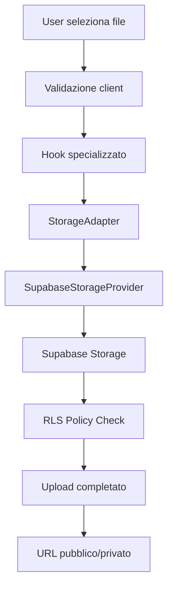

# 📁 Sistema Storage BookingHSE

> Documentazione completa del sistema di gestione file e documenti basato su Supabase Storage

## 📋 Indice

1. [Panoramica](#panoramica)
2. [Architettura](#architettura)
3. [Bucket Configurati](#bucket-configurati)
4. [Componenti e Hook](#componenti-e-hook)
5. [Sicurezza RLS](#sicurezza-rls)
6. [API Reference](#api-reference)
7. [Esempi di Utilizzo](#esempi-di-utilizzo)
8. [Setup e Configurazione](#setup-e-configurazione)
9. [Troubleshooting](#troubleshooting)
10. [Best Practices](#best-practices)

## 🎯 Panoramica

Il sistema storage di BookingHSE fornisce una soluzione completa per la gestione sicura di file e documenti, implementando:

- **Upload sicuro** con validazione MIME e dimensioni
- **Gestione bucket** specializzati per diversi tipi di contenuto
- **Row Level Security (RLS)** per controllo accessi granulare
- **Componenti React** riutilizzabili per UI
- **Hook personalizzati** per logica di business
- **Adapter pattern** per flessibilità e manutenibilità

### Caratteristiche Principali

✅ **Sicurezza**: RLS policies per controllo accessi  
✅ **Performance**: Upload ottimizzati con progress tracking  
✅ **Usabilità**: Componenti drag & drop intuitivi  
✅ **Scalabilità**: Architettura modulare e estendibile  
✅ **Manutenibilità**: Cleanup automatico file temporanei  

## 🏗️ Architettura

### Struttura Modulare

```
src/lib/storage/
├── StorageAdapter.ts          # Interfaccia astratta
├── SupabaseStorageProvider.ts # Implementazione Supabase
├── config.ts                  # Configurazioni bucket
└── README.md                  # Documentazione tecnica

src/hooks/
├── useFileUpload.ts           # Hook generico upload
├── useServiceImageUpload.ts   # Hook specializzato servizi
├── useProfileImageUpload.ts   # Hook specializzato profili
└── useCertificationUpload.ts  # Hook specializzato certificazioni

src/components/ui/
├── FileUpload.tsx             # Componente upload principale
├── ImagePreview.tsx           # Anteprima immagini
└── FileList.tsx               # Lista file con azioni
```

### Flusso di Upload



## 🗂️ Bucket Configurati

### service-images
**Tipo**: Pubblico  
**Dimensione Max**: 5MB  
**Formati**: JPG, PNG, WebP, AVIF  
**Uso**: Immagini dei servizi HSE offerti dai provider

```typescript
// Configurazione
{
  name: 'service-images',
  public: true,
  fileSizeLimit: 5 * 1024 * 1024, // 5MB
  allowedMimeTypes: [
    'image/jpeg',
    'image/png', 
    'image/webp',
    'image/avif'
  ]
}
```

### profile-images
**Tipo**: Pubblico  
**Dimensione Max**: 2MB  
**Formati**: JPG, PNG, WebP  
**Uso**: Avatar e foto profilo utenti

```typescript
// Configurazione
{
  name: 'profile-images',
  public: true,
  fileSizeLimit: 2 * 1024 * 1024, // 2MB
  allowedMimeTypes: [
    'image/jpeg',
    'image/png',
    'image/webp'
  ]
}
```

### certifications
**Tipo**: Privato  
**Dimensione Max**: 10MB  
**Formati**: PDF, JPG, PNG  
**Uso**: Certificazioni e documenti provider

```typescript
// Configurazione
{
  name: 'certifications',
  public: false,
  fileSizeLimit: 10 * 1024 * 1024, // 10MB
  allowedMimeTypes: [
    'application/pdf',
    'image/jpeg',
    'image/png'
  ]
}
```

### temp-uploads
**Tipo**: Privato  
**Dimensione Max**: 5MB  
**Formati**: Tutti  
**Uso**: Upload temporanei con cleanup automatico

```typescript
// Configurazione
{
  name: 'temp-uploads',
  public: false,
  fileSizeLimit: 5 * 1024 * 1024, // 5MB
  allowedMimeTypes: ['*'], // Tutti i formati
  autoCleanup: true,
  cleanupAfterHours: 24
}
```

## 🧩 Componenti e Hook

### Hook Personalizzati

#### useFileUpload
Hook generico per upload file con configurazione flessibile.

```typescript
interface UseFileUploadOptions {
  bucket: string;
  folder?: string;
  generateThumbnail?: boolean;
  onProgress?: (progress: number) => void;
  onSuccess?: (result: UploadResult) => void;
  onError?: (error: Error) => void;
}

const { uploadFile, isUploading, progress, error } = useFileUpload(options);
```

#### useServiceImageUpload
Hook specializzato per immagini servizi con ottimizzazioni specifiche.

```typescript
const {
  uploadFile,
  isUploading,
  progress,
  error,
  uploadedImages
} = useServiceImageUpload();

// Upload con thumbnail automatico
const result = await uploadFile(file, {
  folder: 'safety-training',
  generateThumbnail: true,
  maxWidth: 1200,
  quality: 0.8
});
```

#### useCertificationUpload
Hook specializzato per certificazioni con validazione avanzata.

```typescript
const {
  uploadFile,
  isUploading,
  progress,
  error,
  uploadedCertifications
} = useCertificationUpload();

// Upload certificazione PDF
const result = await uploadFile(pdfFile, {
  folder: 'iso-certifications',
  validatePDF: true,
  extractMetadata: true
});
```

### Componenti UI

#### FileUpload
Componente principale per upload con drag & drop.

```tsx
interface FileUploadProps {
  bucket: string;
  folder?: string;
  accept?: string;
  maxSize?: number;
  multiple?: boolean;
  onUploadComplete?: (files: UploadResult[]) => void;
  onUploadError?: (error: Error) => void;
}

<FileUpload
  bucket="certifications"
  folder="safety-docs"
  accept=".pdf,.jpg,.png"
  maxSize={10 * 1024 * 1024}
  multiple={true}
  onUploadComplete={(files) => {
    console.log('Files uploaded:', files);
  }}
/>
```

#### ImagePreview
Componente per anteprima immagini con controlli.

```tsx
interface ImagePreviewProps {
  src: string;
  alt: string;
  showControls?: boolean;
  onDelete?: () => void;
  onEdit?: () => void;
}

<ImagePreview
  src={imageUrl}
  alt="Service image"
  showControls={true}
  onDelete={() => handleDelete(imageId)}
  onEdit={() => openImageEditor(imageId)}
/>
```

## 🔒 Sicurezza RLS

### Politiche Implementate

#### Upload Policies

```sql
-- Users can upload to their own folder
CREATE POLICY "Users can upload their own files"
ON storage.objects FOR INSERT
WITH CHECK (
  bucket_id IN ('certifications', 'temp-uploads') AND
  auth.uid()::text = (storage.foldername(name))[1]
);

-- Public uploads for profile images
CREATE POLICY "Users can upload profile images"
ON storage.objects FOR INSERT
WITH CHECK (
  bucket_id = 'profile-images' AND
  auth.uid()::text = (storage.foldername(name))[1]
);
```

#### Download Policies

```sql
-- Public buckets readable by all
CREATE POLICY "Public buckets are readable"
ON storage.objects FOR SELECT
USING (bucket_id IN ('service-images', 'profile-images'));

-- Private buckets only by owner
CREATE POLICY "Users can download their own files"
ON storage.objects FOR SELECT
USING (
  bucket_id IN ('certifications', 'temp-uploads') AND
  auth.uid()::text = (storage.foldername(name))[1]
);
```

#### Delete Policies

```sql
-- Users can delete their own files
CREATE POLICY "Users can delete their own files"
ON storage.objects FOR DELETE
USING (
  auth.uid()::text = (storage.foldername(name))[1]
);
```

### Funzioni Helper

#### get_user_storage_usage
Calcola lo spazio storage utilizzato per utente.

```sql
CREATE OR REPLACE FUNCTION get_user_storage_usage(user_id UUID)
RETURNS TABLE(
  bucket_name TEXT,
  file_count BIGINT,
  total_size BIGINT
) AS $$
BEGIN
  RETURN QUERY
  SELECT 
    bucket_id as bucket_name,
    COUNT(*) as file_count,
    SUM((metadata->>'size')::bigint) as total_size
  FROM storage.objects
  WHERE (storage.foldername(name))[1] = user_id::text
  GROUP BY bucket_id;
END;
$$ LANGUAGE plpgsql SECURITY DEFINER;
```

#### cleanup_temp_files
Rimuove file temporanei scaduti.

```sql
CREATE OR REPLACE FUNCTION cleanup_temp_files()
RETURNS INTEGER AS $$
DECLARE
  deleted_count INTEGER;
BEGIN
  DELETE FROM storage.objects
  WHERE bucket_id = 'temp-uploads'
    AND created_at < NOW() - INTERVAL '24 hours';
  
  GET DIAGNOSTICS deleted_count = ROW_COUNT;
  RETURN deleted_count;
END;
$$ LANGUAGE plpgsql SECURITY DEFINER;
```

## 📚 API Reference

### StorageAdapter Interface

```typescript
interface StorageAdapter {
  uploadFile(file: File, options: UploadOptions): Promise<UploadResult>;
  downloadFile(path: string): Promise<Blob>;
  deleteFile(path: string): Promise<void>;
  getPublicUrl(path: string): string;
  getSignedUrl(path: string, expiresIn?: number): Promise<string>;
  listFiles(folder: string): Promise<FileInfo[]>;
}
```

### UploadOptions

```typescript
interface UploadOptions {
  folder?: string;
  fileName?: string;
  generateThumbnail?: boolean;
  maxWidth?: number;
  maxHeight?: number;
  quality?: number;
  onProgress?: (progress: number) => void;
}
```

### UploadResult

```typescript
interface UploadResult {
  path: string;
  url: string;
  size: number;
  mimeType: string;
  thumbnailUrl?: string;
  metadata?: Record<string, any>;
}
```

## 💡 Esempi di Utilizzo

### Upload Certificazione PDF

```typescript
import { useCertificationUpload } from '@/hooks/useCertificationUpload';

function CertificationUploader() {
  const { uploadFile, isUploading, progress } = useCertificationUpload();

  const handleFileSelect = async (file: File) => {
    try {
      const result = await uploadFile(file, {
        folder: 'iso-certifications',
        validatePDF: true
      });
      
      console.log('Certification uploaded:', result.url);
    } catch (error) {
      console.error('Upload failed:', error);
    }
  };

  return (
    <FileUpload
      bucket="certifications"
      accept=".pdf"
      maxSize={10 * 1024 * 1024}
      onFileSelect={handleFileSelect}
      loading={isUploading}
      progress={progress}
    />
  );
}
```

### Upload Immagine Servizio

```typescript
import { useServiceImageUpload } from '@/hooks/useServiceImageUpload';

function ServiceImageUploader() {
  const { uploadFile, uploadedImages } = useServiceImageUpload();

  const handleImageUpload = async (file: File) => {
    const result = await uploadFile(file, {
      folder: 'safety-training',
      generateThumbnail: true,
      maxWidth: 1200,
      quality: 0.8
    });

    // Immagine e thumbnail disponibili
    console.log('Image URL:', result.url);
    console.log('Thumbnail URL:', result.thumbnailUrl);
  };

  return (
    <div>
      <FileUpload
        bucket="service-images"
        accept="image/*"
        onFileSelect={handleImageUpload}
      />
      
      <div className="grid grid-cols-3 gap-4">
        {uploadedImages.map((image) => (
          <ImagePreview
            key={image.path}
            src={image.url}
            alt="Service image"
            showControls={true}
          />
        ))}
      </div>
    </div>
  );
}
```

### Download File Privato

```typescript
import { storageAdapter } from '@/lib/storage';

const downloadCertification = async (filePath: string) => {
  try {
    // Per file privati, usa signed URL
    const signedUrl = await storageAdapter.getSignedUrl(
      filePath,
      3600 // Scade in 1 ora
    );
    
    // Apri in nuova finestra o scarica
    window.open(signedUrl, '_blank');
  } catch (error) {
    console.error('Download failed:', error);
  }
};
```

## ⚙️ Setup e Configurazione

### 1. Configurazione Supabase

```bash
# 1. Esegui script SQL per bucket e policies
node scripts/execute-storage-setup.cjs

# 2. Oppure manualmente nel SQL Editor
# Copia contenuto di database/storage-setup.sql
```

### 2. Variabili Ambiente

```env
# .env
VITE_SUPABASE_URL=https://your-project.supabase.co
VITE_SUPABASE_ANON_KEY=your_anon_key
SUPABASE_SERVICE_ROLE_KEY=your_service_key # Per script automatici
```

### 3. Configurazione Bucket

```typescript
// src/lib/storage/config.ts
export const STORAGE_CONFIG = {
  buckets: {
    'service-images': {
      public: true,
      fileSizeLimit: 5 * 1024 * 1024,
      allowedMimeTypes: ['image/jpeg', 'image/png', 'image/webp']
    },
    // ... altri bucket
  }
};
```

## 🔧 Troubleshooting

### Errori Comuni

#### "Bucket not found"
```bash
# Verifica bucket esistenti
SELECT name FROM storage.buckets;

# Ricrea bucket se necessario
node scripts/execute-storage-setup.cjs
```

#### "Access denied"
```sql
-- Verifica policies attive
SELECT * FROM pg_policies WHERE tablename = 'objects';

-- Test permessi utente
SELECT auth.uid(); -- Deve restituire UUID utente
```

#### "File size exceeded"
```typescript
// Verifica configurazione bucket
const config = STORAGE_CONFIG.buckets['bucket-name'];
console.log('Max size:', config.fileSizeLimit);

// Comprimi file prima dell'upload
const compressedFile = await compressImage(file, {
  maxWidth: 1200,
  quality: 0.8
});
```

### Debug Upload

```typescript
// Abilita logging dettagliato
const { uploadFile } = useFileUpload({
  bucket: 'certifications',
  onProgress: (progress) => console.log('Progress:', progress),
  onError: (error) => console.error('Upload error:', error)
});

// Test validazione file
const isValidFile = validateFile(file, {
  maxSize: 10 * 1024 * 1024,
  allowedTypes: ['application/pdf']
});
```

## 🎯 Best Practices

### Sicurezza

1. **Sempre validare file lato client E server**
   ```typescript
   // Client-side
   const isValid = validateFile(file, config);
   
   // Server-side (RLS policies)
   -- Validazione automatica in Supabase
   ```

2. **Usare signed URLs per file privati**
   ```typescript
   // ❌ Non esporre path diretti
   const badUrl = `${supabaseUrl}/storage/v1/object/public/certifications/${path}`;
   
   // ✅ Usa signed URLs
   const goodUrl = await storageAdapter.getSignedUrl(path, 3600);
   ```

3. **Implementare rate limiting**
   ```typescript
   // Limita upload per utente
   const uploadCount = await getUserUploadCount(userId, 'last_hour');
   if (uploadCount > 10) throw new Error('Rate limit exceeded');
   ```

### Performance

1. **Ottimizza immagini automaticamente**
   ```typescript
   const result = await uploadFile(file, {
     generateThumbnail: true,
     maxWidth: 1200,
     quality: 0.8
   });
   ```

2. **Usa lazy loading per liste file**
   ```typescript
   const { files, loadMore, hasMore } = useFileList({
     bucket: 'certifications',
     pageSize: 20
   });
   ```

3. **Implementa cleanup automatico**
   ```sql
   -- Cron job per pulizia file temporanei
   SELECT cron.schedule('cleanup-temp-files', '0 2 * * *', 
     'SELECT cleanup_temp_files();'
   );
   ```

### UX

1. **Feedback visivo durante upload**
   ```tsx
   <FileUpload
     onProgress={(progress) => setUploadProgress(progress)}
     showProgress={true}
     showPreview={true}
   />
   ```

2. **Gestione errori user-friendly**
   ```typescript
   const getErrorMessage = (error: Error) => {
     if (error.message.includes('size')) {
       return 'File troppo grande. Massimo 10MB.';
     }
     if (error.message.includes('type')) {
       return 'Formato file non supportato.';
     }
     return 'Errore durante l\'upload. Riprova.';
   };
   ```

3. **Drag & drop intuitivo**
   ```tsx
   <FileUpload
     dragActiveText="Rilascia qui i file"
     dragInactiveText="Trascina file qui o clicca per selezionare"
     multiple={true}
   />
   ```

---

**📞 Supporto**: Per problemi o domande, consulta la [documentazione Supabase Storage](https://supabase.com/docs/guides/storage) o apri un issue nel repository del progetto.